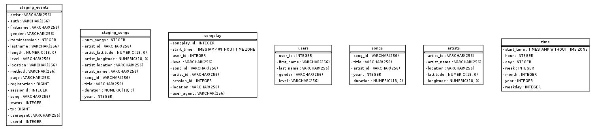

# Sparkfy - Data Warehouse

This project reads a group of files from an existing S3 Bucket, copies them to staging tables  in Redshift and then processes the data into star schemas tables.

## File Content

1. README.md:  This file, project presentation.
2. [sql_queries.py](sql_queries.py): This file contains all sql statements used in the project. It includes drop tables, create table, copy and insert declarations. 
3. [create_tables.py](create_tables.py): This file is used to call the queries which create the tables.
4. [etl.py](etl.py): In this file are defined the functions to copy, transform and insert the data in the database. 
5. [dwh.cfg](dwh.cfg): This file contains the necessary configuration requiremnts to connect to the AWS, including the Redshift Cluster, the IAM Role and S3 Bucket.
6. [Examples.ipynb](Examples.ipynb): This file contains same examples of queries and analysis that can be performed once the tables are finished
7. [Create_ERD.ipynb](Create_ERD.ipynb): this file is used to generate the ERD displayed below

## Tables

### Staging Tables
- staging_events = [artist, auth, firstName , gender, itemInSession, lastName, length, level, location, method, page, registration, sessionId, song, status, ts, userAgent, userId]

- staging_songs =[num_songs, artist_id, artist_lattitude, artist_longitude, artist_location, artist_name, song_id, title, duration,year]

### Analytics Tables  

- songplay = [songplay_id, start_time, user_id, level, song_id, artist_id, session_id, location, user_agent]

- song = [song_id, title, duration, year, artist_id] 

- users = [user_id, first_name, last_name, gender, level] 

- artist = [artist_id, name, latitude, longitude, location] 

- time = [start_time, hour, day, week, month, year, weekday] 

## Running

In order to run the project, the user will need a python 3 console, an existing Redshift Cluster and a IAM Role with read access to Redshift. 

After the preparation above is complete follow the steps:
1. Go to [config file](dwh.cfg) and insert ENDPOINT (HOST) and ARN
2. Open a python 3 console
3. Run sql_queries.py (type: `!python3 sql_queries.py`)
4. Run create_tables.py (type `!python3 create_tables.py`)
5. Run etl.py (type `!python3 etl.py`)

The etl.py should take a while to finish loading

After these steps, the user can open [Examples.ipynb](Examples.ipynb) to see some queries and plots of the data.
